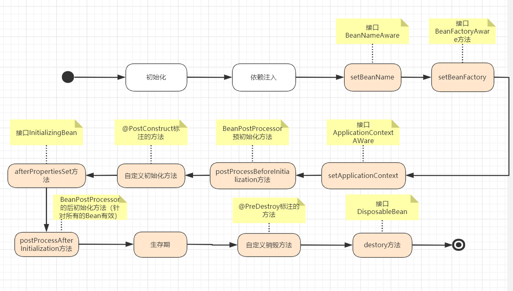

## SpringBoot 源码阅读笔记
> 结合项目构建阅读 SpringBoot 源码，去理解源码中的设计和解决的问题

### 生命周期
- SpringApplication 的生命周期 
- SpringBean 的生命周期 
- 参考 cn.ecomb.park.spring.lifecycle.LifeCycle

**生命周期实践例子**
- 实现自定义 RPC 框架时，使用 BeanFactoryPostProcessor 实现类的post方法，讲扫描出来的自定注解方法封装成接口
- 在一种方式直接给自定以注解上加上 @Component 注解，使用 BeanPostProcessor 实现类拦截到，并进行处理。

### 问题
- JVM 栈帧结构是什么样的，初始化时获取了当前栈帧
- Spring 的 listener 是如何实现的
    - 流程节点上调用具体的方法
- Spring的SPI机制（spring.factories机制）

### 记录
- 从 ApplicationContext 的继承接口来看，设计一个这样的系统是如何处理的？
- 功能的声明与边界的划分是如何定义的
- 对事物的抽象

### ** 问题 ** SpringBoot 启动流程
> SpringBoot 实现了什么功能，如何实现的？

 
### ** 设计 ** 接口加解密封装