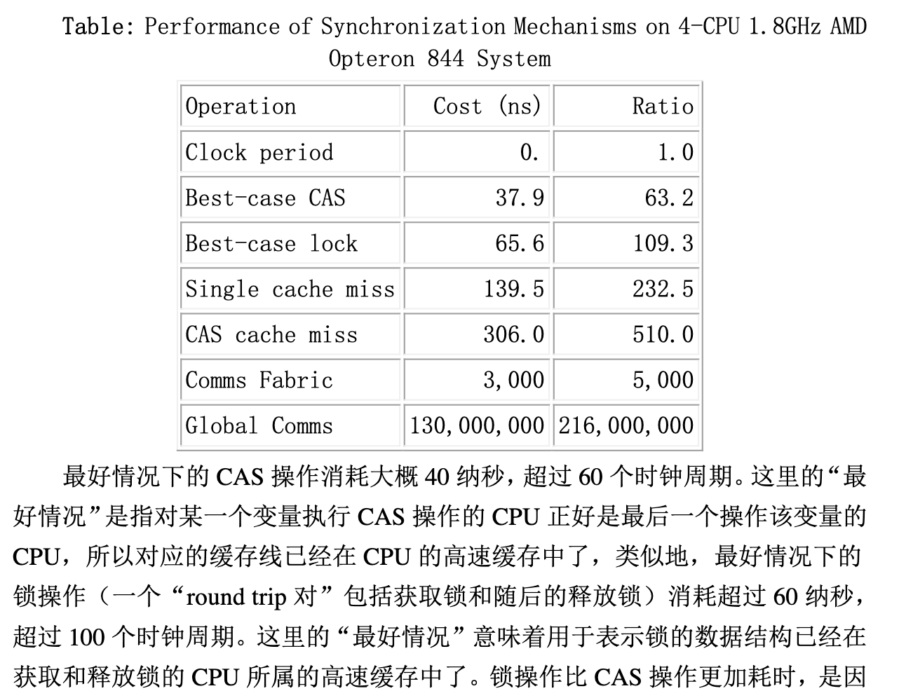

##《深入理解并行编程》阅读笔记

**第一部分**
- 并发编程的目标
性能生产率通用性

具体来说，如果将计算机的CPU周期作为最小单位，并标定为1秒。那么，可以得到以下表格。

任务类型	实际时间	等价时间
CPU周期	0.3纳秒	1 秒
1级缓存访问	0.9纳秒	3秒
2级缓存访问	2.8纳秒	9秒
3级缓存访问	12.9纳秒	43秒
内存访问	120纳秒	6分
固态硬盘访问	50~150微妙	12~6天
普通硬盘访问	1~10毫秒	1~12个月
网络访问：从洛杉矶到纽约	40毫秒	4年
网络访问：从洛杉矶到英国	81毫秒	8年
网络访问：从洛杉矶到澳洲	183毫秒	19年
热重启(或软重启)	4秒	423年
冷重启(或硬重启)	40秒	4000年

对比 CAS/Lock 耗时：

### 并发编程导论笔记
- 并发编程中的问题，往往源于缓存导致的可见性问题、线程切换导致的原子性问题以及编译优化带来的有序性问题。
- Java 使用 happens-before 规则来屏蔽具体细节保证，指导 JVM 在指令生成的过程中穿插屏障指令。
- 并发控制中主要考虑线程之间的通信(线程之间以何种机制来交换信息)与同步(读写等待，竞态条件等)模型，在命令式编程中，线程之间的通信机制有两种：共享内存和消息传递。Java 就是典型的共享内存模式的通信机制；而 Go 则是提倡以消息传递方式实现内存共享，而非通过共享来实现通信。
  

## 资源
- [《深入理解并行编程》在线pdf](http://ifeve.com/wp-content/uploads/2013/05/%E6%B7%B1%E5%85%A5%E7%90%86%E8%A7%A3%E5%B9%B6%E8%A1%8C%E7%BC%96%E7%A8%8BV1.0.pdf)
- [并发编程导论](https://juejin.cn/post/6844903828404305934#heading-28)