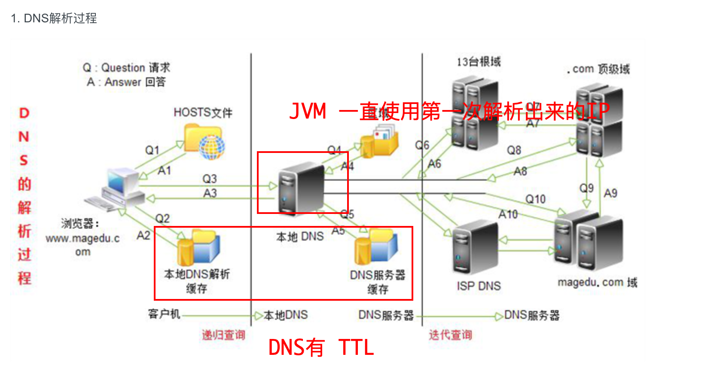

### RabbitMQ JVM DNS 缓存测试

### JVM DNS解析过程


### JVM DNS 配置方式
- 启动参数方式
```java
-Dsun.net.inetaddr.ttl=3
-Dsun.net.inetaddr.negative.ttl=1
```
- java 编码方式
```java
System.setProperty("sun.net.inetaddr.ttl", "3");
System.setProperty("sun.net.inetaddr.negative.ttl", "1");
```

### 测试步骤
- 测试一
1. 启动服务正常发送/消费消息
2. RabbitMQ 停机
3. 修改 RabbitMQ 容器映射端口，重启服务，查看发送/消费端发送 IP 情况
**确认 JVM 会缓存 DNS 解析**

- 测试二
1. 添加 TTL 启动参数，启动服务正常发送/消费消息
2. RabbitMQ 停机，查看消情况
3. 修改 RabbitMQ 容器映射端口，重启服务，查看发送/消费端发送 IP 情况
**确认修改 TTL 的作用**