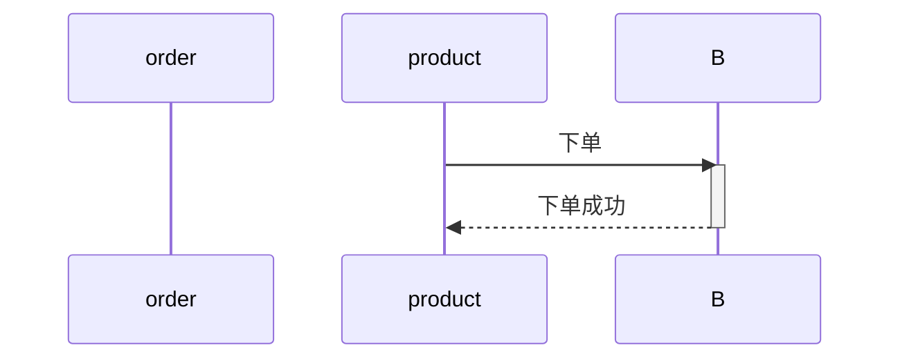
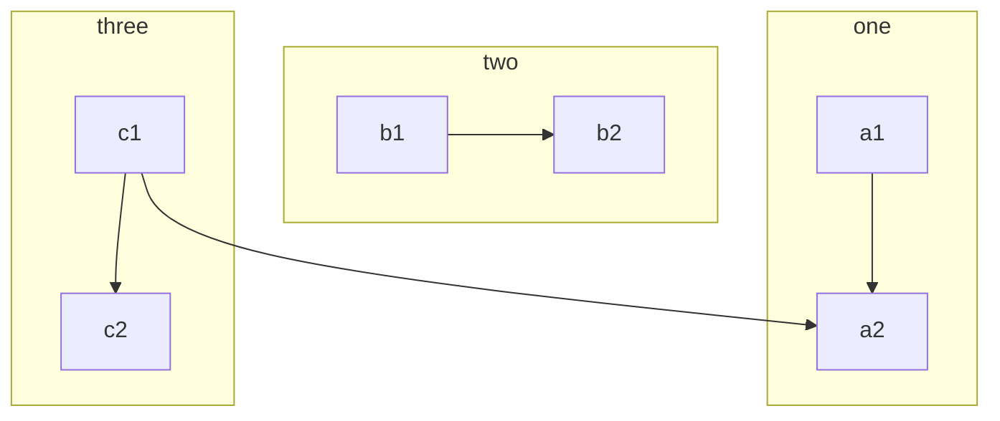

### MarkDown 使用笔记

### 绘制序列图 Sequence Diagram

```seq
Andrew->China: Says Hello
Note right of China: China thinks\nabout it
China-->Andrew: How are you?
Andrew->>China: I am good thanks!
```

```flow
st=>start: Start|past:>http://www.google.com[blank]
e=>end: End|future:>http://www.google.com
op1=>operation: My Operation|past
op2=>operation: Stuff|current
sub1=>subroutine: My Subroutine|invalid
cond=>condition: Yes
or No?|approved:>http://www.google.com
c2=>condition: Good idea|rejected
io=>inputoutput: catch something...|future

st->op1(right)->cond
cond(yes, right)->c2
cond(no)->sub1(left)->op1
c2(yes)->io->e
c2(no)->op2->e
```




```graph LR
    A-. text .-> B
```
```
graph TD
    Start --> Stop
```



## 资源
- [mermaid 在线编辑](https://mermaid-js.github.io/mermaid-live-editor/#/edit/eyJjb2RlIjoiZ3JhcGggVERcbiAgQVtDaHJpc3RtYXNdIC0tPnxHZXQgbW9uZXl8IEIoR28gc2hvcHBpbmcpXG4gIEIgLS0-IEN7TGV0IG1lIHRoaW5rfVxuICBDIC0tPnxPbmV8IERbTGFwdG9wXVxuICBDIC0tPnxUd298IEVbaVBob25lXVxuICBDIC0tPnxUaHJlZXwgRltmYTpmYS1jYXIgQ2FyXVxuXHRcdCIsIm1lcm1haWQiOnsidGhlbWUiOiJkZWZhdWx0In19)
- [脚本化图表参考指南](https://madmaxchow.github.io/VLOOK/chart.html#vk-id-fig1)