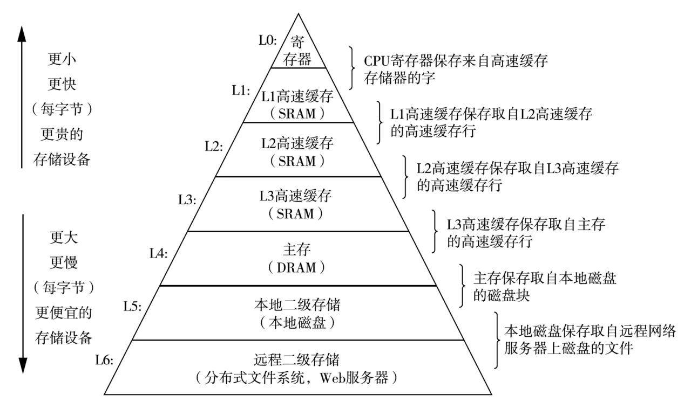
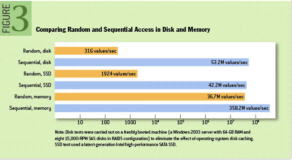

### 消息队列和调度使用场景

**记录**
- 定时：一定时间间隔规律的执行，比如使用 cron 表达式
- 延时：未来某一个时间间隔后执行一次，比如使用 RabbitMQ 的「死信队列」或者延时队列的插件来实现，也可以用是定时任务，只执行一次来实现。
- 「使用6个7200rpm、SATA接口、RAID-5的磁盘阵列在JBOD配置下的顺序写入的性能约为600MB/秒，但随机写入的性能仅约为100k/秒，相差6000倍以上。」--kafka文档；在看 MySql设计原理时，有提到 I/O 优化的两种方式，1. 随机读写改成顺序读写；2. 多次读写改成批量读写。没想到顺序与随机读写的差别这么大。「现代操作系统提供了 read-ahead 和 write-behind 技术，read-ahead 是以大的 data block 为单位预先读取数据，而 write-behind 是将多个小型的逻辑写合并成一次大型的物理磁盘写入。」
- 对比  和 

- IO操作
    - 现代的unix 操作系统提供了一个高度优化的编码方式，用于将数据从 pagecache 转移到 socket 网络连接中；在 Linux 中系统调用 sendfile 做到这一点。
    - 为了理解 sendfile 的意义，了解数据从文件到套接字的常见数据传输路径就非常重要：
    1. 操作系统从磁盘读取数据到内核空间的 pagecache
    2. 应用程序读取内核空间的数据到用户空间的缓冲区
    3. 应用程序将数据(用户空间的缓冲区)写回内核空间到套接字缓冲区(内核空间)
    4. 操作系统将数据从套接字缓冲区(内核空间)复制到通过网络发送的 NIC 缓冲区

### Kafka
**笔记**
- 点对点：点是什么，应该是一个唯一的ID，而不是执行单元
- 发布订阅：其实在讲这些模式的时候，应该先确定执行单元是什么。

**实践测试**

### Spring-Kafka
**客户端设计**

*提交策略*
record，batch，time，count，count_time，manual，manual_immediate

**使用记录**
- groupId 的优先级：注解的（groupId > id）> config 的 groupId

**实践测试**
- 队列/发布-订阅
- 流处理
- 批处理