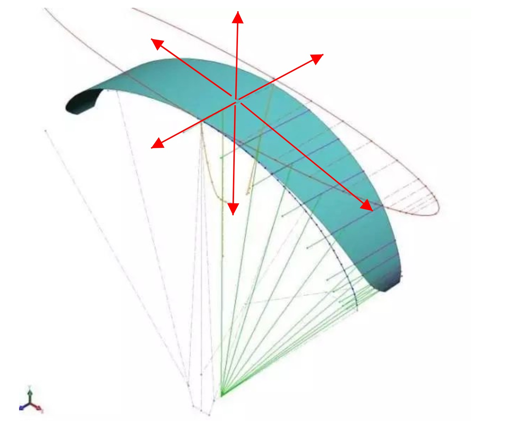
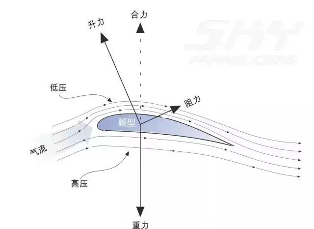
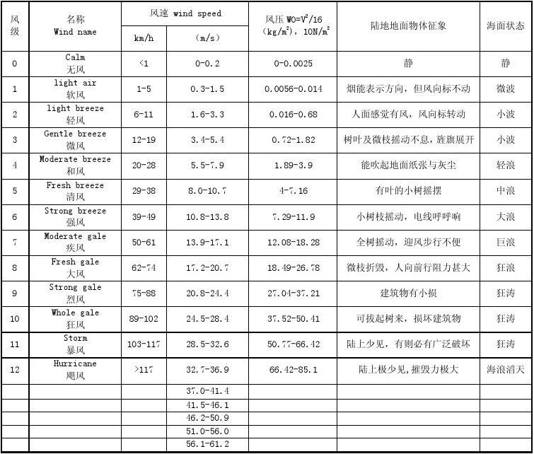

### 滑翔伞-day-1
滑翔伞装备介绍，主要：主伞，座袋，副伞。辅助：头盔，对讲机，GPS，防嗮，高帮鞋等
副伞使用，以及适用场景。
1. 往下抛副伞，不缠绕主伞
2. 三种适用场景：主伞 塌陷不可恢复；眩晕不适不能承受；气流不控还是太高？不记得了
**座袋穿戴：**
1. 穿座袋从下到上，下座戴从上到下。
2. 每一个卡扣，扣上后，回扯，检查是否扣紧。
3. 双腿扣带可以容下一手厚间距，胸扣条带捋顺。
4. 背带松紧合适。
**抖伞：**
1. 观察风向，逆风起步。
2. 铺伞，伞口朝上；整理伞绳，无杂草，无缠绕。
3. 伞绳有加速绳方向朝外，挂在座袋悬挂上。
4. 双手，从手背方向握住刹车绳，再握紧 A 组伞绳（最上一组）。
5. 手臂稍微弯曲，稳定，与伞平衡，前倾后倾会导致伞偏向于一边，在于刹车绳拉的多与少。
6. 垂直站伞中间，垂直，爆发起步。
7. 伞充气后，立于正上方，放开 A 组伞绳，双手向后伸直。
8. 跑动过程中，偏向那一边，便跑向那一边。
比如偏向右边，就跑向右边，在于拉低左边，并使右边更多的充气，达到左右平衡。
是不是也可以拉多一点左边的刹车，放一点右边的刹车，而达到平衡？
9. 停止后，一边伞绳绕过头顶，转身，这样更方便收伞。
10. 边收伞绳，边抖，更方便伞绳有条理。

**折伞：**
1. 展开主伞，伞绳放在伞上，伞绳悬挂处放外面。
2. 波浪形折叠，最后对折，伞口向上。

**理解：**
- 严谨，规范
- 习惯，跑出之前检查 CHECK_LIST

### 滑翔伞-day-2
**理论学习**
1. 三个「轴」(横轴、纵轴、竖轴)，其实就是立体空间的三个维度坐标系(X、Y、Z)，以伞弧面中心为原点；驾驶员最佳最值应该是在原点正下方，伞绳绷直，前后(不考虑伞面弧形情况下)，左右对称；逗伞的过程就是训练自身保持这个平衡的能力。
   
2. 怎么逗伞调节：逗伞是一个平衡的过程，每一个轴上面的作用力都是基于原点对称的，就像跷跷板；那么在调节的过程中，就可以增加低于平衡线一方的升力，减少高于平衡线一方的升力；具体就是：
   1. 比如偏向右边，就跑向右边，增加右边主伞的充气，以增加右边的升力；拉低左边，减少左边的上升力；
   2. 拉左边的刹车时，左边的气体应该也会，被挤压到右边，增加右边的升力，所以左右配合操作时，要适量(类似点刹)，这样更好达到平衡。
   
3. 气象条件，风速，风速观察：气象条件好的时候才去飞伞，佛系，严谨。
   
4. 理论知识
   1. 滑翔（降）比：滑翔比是指滑翔伞在飞行过程中前进距离和高度下降之间的比值。 比如：滑翔比：8：1
   2. 地速、空速、风速三个速度的关系：地速：相对与地面的速度；空速：相对于空气的速度；风的速度，顺风时：地速=空速+风速，逆风时：地速=空速-风速
   3. 风的类型：阵风、旋风、海陆风、山谷风。风的形成跟光照导致的空气密度有关，密度越大压强越大，反之亦然。
**逗伞总结**
在昨天总结的基础上，起步前，准备好自己的 CheckList：手臂平衡-放A-压刹车-手臂向后伸值
1. 检查双手握刹车和 A 组情况，双手，手臂与身体在同一平面；（目的使主伞拉起后，受力均匀）
2. 主伞到达头顶后，释放 A 组；
3. 压一点刹车；（其实这一步在，第四步的时候，自然会出现）
4. 双臂向后伸直，抬高(感受到双臂向后的力量)，压低上半身，与地平衡。这个过程，手不可向下画弧线到后面，而是尽量保持在同一水平面转换，目的时间少对刹车的影响。
**理解**
- 起步后，主伞有向后的反作用力时，说明伞已经与地面平衡，需要顶住，加一股爆发力，将伞向上拉起。因为伞口上面是略微向前的，这时是在开始向伞内充气。这个充气的过程中，满满地产生向上的升力，从而使伞到达正上方。
- 行驶过程中，主要是调节伞平衡，前后，左右和垂直的平衡都需要考虑。
- 出发前，检查 CheckList，相当于将流程加载到大脑更浅层次，更好的提高注意力，使流程更流畅。
- 练习完一次后，记住问题点，下一次检查 CheckList 时，想好问题的处理方案，有利于修复问题。

### 滑翔伞-day-3
**反身起伞总结**
1. 在逆风，风速达到 1.6m/s 以上，可以选择反身起伞。
2. 相比正向起伞，反身起伞更有利与在短距离上，将伞上头。
3. 伞翼平衡后，可以使用身体后倾的力量来，拉升伞体。
4. 反身起伞的控伞要领更正向起伞一样，拉高走低。
5. 在拉高这个过程中，迅速切换左右手刹车最重要，需要有预判。当一边太高时，要即使切换刹车，并急拉一定的刹车量，使高度降下来，太慢就会导致控制不住上升速度。其实是需要一个上升的反作用力，来抵消上升的动作，要观察上升的速度来，判断使用多大的力，最好是有预判，不要让其上升的太高再处理。
6. 因为是反身起伞，走低过程是在走 Z 字形后退的，所以最好是先单独练习一下 Z 字型后退，这样在组合运动时退的更加从容。后退的角度最好是 45 度，这样有后退的量，也有左右移动的量；如果伞走得更快，可以直线往后退，这样更好跟上伞，同时也可以带两边刹车，增加阻力，让伞减速。

### 滑翔伞-day-4
**反身逗伞总结**
1. 需要根据风力大小，使用合适力度，使伞柔和上升，不需要拉的太急。
2. 根据风向，提前判断那边会先起来，就先抓那边刹车；比如判断右边会先起来，那么在起伞之前，左手抓刹车（控制右边的刹车）
3. 伞起来之后要独立练习，切换左右手控制刹车。左右控制刹车，控制的是左右平衡。
4. 前后平衡控制，如果伞走的太快，双手带一点刹车；如果风力减小，需要微扎马步，使用身体重量微拉一下伞或者后退，这一步要细微操作，预判微调是最好，操作过多就会导致伞走得太快。

**反身起伞总结**
- 反身起飞，需要起伞转身一气呵成，转身动作要快速。整体主要分五步：
  1. 起：把伞柔和的拉到头顶
  2. 放：放 A 组
  3. 压：如果太快带一点刹车，力度达到目的即可
  4. 转：伞上头稳定后，快速转身。身体不要倾斜后方，腰背垂直地面，减少转身过程中，因身体重量给伞施力。
  5. 走：快步跑出

### 滑翔伞-day-5
**起伞总结**
- 起伞前预判提前量，根据风速大小，判断使用多大的力，做到柔和从容的一把起伞上头。
- 反身起伞转身要流畅，马步要稳，身子要直，感受伞的力量，控制平衡。
- 不管是正起，还是反起，最好是多多练习，形成肌肉记忆，理论知识&教学知识&肌肉记忆要结合。
- 起伞基础做到非常熟悉，有利于形成本能反应，有利于在起飞时，有注意力去应急反应，处理非常规问题。
- 正起：起放带弯加速；反起：起放[转｜带]弯加速。

**起飞总结**
- 心态要平稳，这样才能不慌，才能有效的思考起伞要点，才有大脑空间去处理应急问题。
- 基础要扎实，这样才能从容的处理过程中的问题，问题可能是已知的，也有可能是未预料到的。只有基础扎实才能去实时地发现现场问题，并知道如何解决。
- 要有速度，影响速度的要素：风力，跑动的速度（鞋的摩擦力），刹车量。
- 目前的空中飞行过程中是平滑的，下降速度不会太快，这样的失重感不会很强。
- 即使操作指令，熟练一些后，可以留意转动角度。
- 慢慢熟悉高度，以及降落高度。

### 滑翔伞-day-6
**起飞总结**
- 注意起飞场的加速位置，以及当时的风速。
- 跑动过程注意压腰，这样就会有升力。
- 起飞过程要保持头脑清醒，不然就会头脑空白，不知道要怎么处理了。

如果有一天，
晴空万里，清风拂面，
我将起航，迎着日出，
带着对自由的向往，
飞向远方。

如果有一天，
我在空中飞翔，
我将微带双翅，
这是对蓝天的敬意。

如果有一天，
我们在空中相遇，
我会拉低我的右翼，
向你致敬。

如果有一天，
北风迎面，白雪皑皑，
我会出发，登上山顶，
带上回忆，
掠过夕阳。

7/5/2021

### 滑翔伞-day-7
**随记**
尽心修炼，享受远方。
回到城市，车来车往，行色匆匆。

## 布丁飞行滑翔伞-网站思路

- 快速实现，先做一个东西出来在说，再不断的迭代

### 思考
- **角度一**
  - 滑翔伞是一种生活
  - 一种对自由的向往，是一次浮出水面的呼吸。
  - 到天空去，看看自己。
  - 那一年，你去飞滑翔伞了吗。
- **角度二**
  - 大部分人来学滑翔伞，体验滑翔伞，本质上是来干什么的？
    - 开心？不是，好奇是一个，但不是重点。
    - 为了社交，熟人的社交，陌生人的社交。在寻找自我展现，寻找有价值的信息。
    - 一个据点，离开城市，放慢自己。
    - 真正热爱。

### 产品设计思路
- 

### 网站建设思路

### 运营思路
- 关键词，深圳滑翔伞，大亚湾，双月湾滑翔伞；地名+滑翔伞；培训，体验。
- 海景，大小山，场地
- 流量思路
  - 各种平台，美团，点评，携程，蚂蚁，知乎，百度，Google，外链。
  - 地图标记收录
  - 事件，大 V 流量
- 合作思路

### 域名
- puddingglider.com
- puddingglider.cn

### 其他网站参考
- [亚联飞行](http://www.yalianfly.com/)
- [云途飞行](http://www.cloudstreet.com.cn/)
- [桑巴滑翔伞俱乐部](http://www.sambasp.com/Default.aspx)