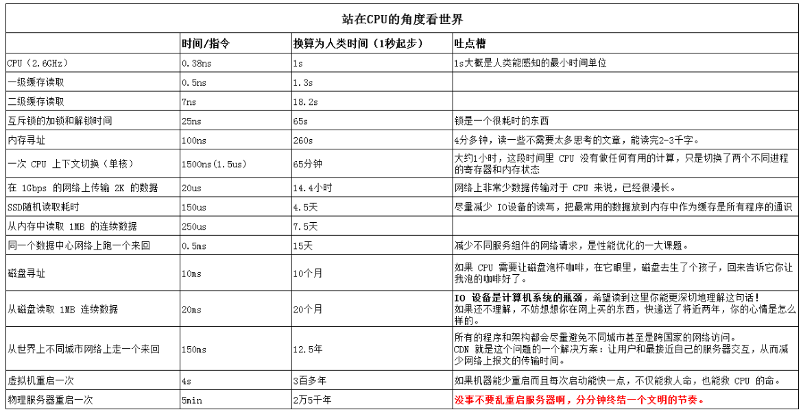

### 零散笔记

1. ulimit 用于限制 shell 启动进程所占用的资源，支持以下各种类型的限制：所创建的内核文件的大小、进程数据块的大小、Shell 进程创建文件的大小、内存锁住的大小、常驻内存集的大小、打开文件描述符的数量、分配堆栈的最大大小、CPU 时间、单个用户的最大线程数、Shell 进程所能使用的最大虚拟内存。同时，它支持硬资源和软资源的限制。
（一次性会话）

2. 使用 /etc/security/limits.conf 文件存储 ulimit 设置。

3. 
参考网址：https://www.zhihu.com/question/51614321
   
   