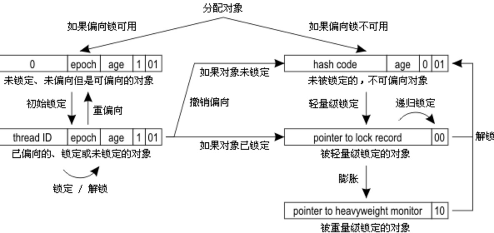

## 锁使用实践笔记

### 场景一：双重检测单例
实践代码：cn.ecomb.park.pattern.build.DoubleCheckSingleton
**问题**：为什么这里不直接使用自旋锁.

- 偏向锁：
    - 在没有竞争的情况下，偏向第一次访问的线程。
    - 偏向锁可以提高带有同步但无竞争的程序性能。但是如果程序中大多数锁总是被多个不同的线程访问，那么偏向锁模式就是多余的。
    - 作用：消除数据无竞争情况下的同步原语，进一步提高程序的运行性能。
- 轻量级锁
    - 在无竞争的情况下，虚拟机使用 CAS 操作，尝试将对象的 Mark World 更新为指向 Lock Recode 的指针，并将 Lock Recode 里的 owner 指针只指向对象的 Mark World。
    - 作用：在没有多线程的竞争下，减少传统重量级锁使用操作系统互斥量产生的性能消耗。
- 重量级锁
    - 使用操作系统内核态的 Mutex Lock 实现，获取互斥量需要从用户态切换到内核态，切换耗时。

- 理解了怎么实现的，就很好区分使用场景了，轻量级锁所适应的场景是线程交替执行同步块的情况，如果存在同一时间访问同一锁的情况，就会导致轻量级锁膨胀为重量级锁。
- 在当前场景下，肯定会存在多线程竞争的情况，并且如果直接使用自旋锁，这里需要发送请求出去，无论多快，相比自旋都耗时太长，导致自旋超时阻塞。

**摘录**
JVM对于自旋周期的选择，在jdk1.5时规定，当自旋操作超过了默认的限定次数10次，仍然没有获取到锁，那就应该使用传统的方式去挂起线程（当然用户可也以可使用参数-XX：PreBlockSpin来更改）。
在1.6时便引入了适应性自旋锁，适应性自旋锁意味着自旋的时间不在是固定的了，而是由前一次在同一个锁上的自旋时间以及锁的拥有者的状态来决定，
基本认为一个线程上下文切换的时间是最佳的一个时间，同时JVM还针对当前CPU的负荷情况做了较多的优化
- 如果平均负载小于CPUs则一直自旋
- 如果有超过(CPUs/2)个线程正在自旋，则后来线程直接阻塞
- 如果正在自旋的线程发现Owner发生了变化则延迟自旋时间（自旋计数）或进入阻塞
- 如果CPU处于节电模式则停止自旋
- 自旋时间的最坏情况是CPU的存储延迟（CPU A存储了一个数据，到CPU B得知这个数据直接的时间差）
- 自旋时会适当放弃线程优先级之间的差异

**总结**
- 尽量不用锁
- 减少锁的时间，也就是减少同步代码
- 减少锁的粒度，不限制不需要的同步的资源，比如 ConcurrentHashMap 的分段锁

### 关于锁的文章
- [不可不说的Java“锁”事](https://tech.meituan.com/2018/11/15/java-lock.html)